# 🛡️ Guard Agent: The Secure AI Automation Framework


Built for the **Auth0 for AI Agents: Authorized to Act Hackathon**, Guard Agent is a high-security, autonomous research and automation platform. It leverages the **Auth0 for AI Agents Token Vault** to bridge the gap between powerful LLM agents and secure enterprise/personal data.

> [!IMPORTANT]
> **Pushing the boundaries of what AI agents can do and become.**
> Guard Agent creates a "Trust Orchestrator" where users can safely delegate complex tasks while maintaining absolute control over their data, powered by the **Auth0 for AI Agents Token Vault**.

---

## 🏗️ The 3-Agent Security Pipeline (LangGraph)

Guard Agent operates on a stateful, multi-agent graph architecture that enforces human-in-the-loop consent at every sensitive step.

| Agent | Role | Responsibility |
| :--- | :--- | :--- |
| **1. IntentNode** | **Planner** | Analyzes requests, researches topics (via Firecrawl), and determines tool-calling strategy. |
| **2. ContractNode** | **Safety Officer** | Generates human-readable **Action Contracts** and provides granular resource selection. |
| **3. ExecutorNode** | **Secure Worker** | Executes actions ONLY after verified consent, retrieving secrets from **Auth0 Token Vault**. |

---

## 📐 Architecture & Communication Flow

```mermaid
sequenceDiagram
    participant User as User (Browser)
    participant Agent as Guard Agent (Backend)
    participant Auth0 as Auth0 Token Vault
    participant API as Third-Party API (Google Docs/Drive)

    User->>Agent: User Request (e.g., "Research and save to Doc")
    
    rect rgb(20, 20, 40)
        Note over Agent: IntentNode (Planning)
        Agent->>Agent: Internal Research (Firecrawl/Jina)
    end

    rect rgb(40, 20, 20)
        Note over Agent: ContractNode (Safety/Consent)
        Agent->>Auth0: Fetch Resource Metadata (e.g., File List)
        Auth0-->>Agent: Drive File Metadata
        Agent-->>User: Return Action Contract + File Selection UI
    end

    Note over User, Agent: ⏸️ Execution Paused: Waiting for User Consent

    User->>Agent: Approve Contract (Files Selected: A, B)

    rect rgb(20, 40, 20)
        Note over Agent: ExecutorNode (Secure Action)
        Agent->>Auth0: Request Scoped Access Token
        Auth0-->>Agent: OAuth Token
        Agent->>API: Execute Action (e.g., Document Created)
        API-->>Agent: Result
    end

    Agent-->>User: Task Complete! (Summarized output)
```



---

## 📋 The Anatomy of an Action Contract

The **Action Contract** is the cornerstone of our trust model. It is generated dynamically and includes:

*   **Human-Readable Intent**: Clear goals (e.g., "Create a formatted Project Proposal").
*   **Step-by-Step Execution Plan**: Detailed breakdown of actions.
*   **Risk Level Assessment**: Categorizes actions (**Low, Medium, High**).
*   **Data Boundaries**: Explicitly lists **Data Used** and **Data NOT Used**.
*   **Selective Resource Picker**: Dynamic selection of exactly which files the agent can access.

---

## 🛡️ Security Architecture (Auth0 Integration)

### 1. Auth0 Token Vault: "Zero Secrets in the Browser"
We utilize the **Auth0 Token Vault** to eliminate local credential storage. 
- **Secret Management**: Google OAuth tokens are stored **exclusively** in Auth0's encrypted backend vault.
- **Short-Lived Access**: The backend retrieves tokens only for the duration of an approved action.

### 2. Selective Scope Authorization (SSA)
 SSA allows the user to grant access to **exactly the resources needed** for a specific task, ensuring the principle of least privilege.

---

## 🧪 Technology Stack

*   **Orchestration**: LangChain & LangGraph (Python).
*   **Inference**: Groq (Llama 3 @ 70B) for ultra-low latency planning.
*   **Identity**: Auth0 (OIDC) + **Auth0 Token Vault (Secret Management)**.
*   **Frontend**: Next.js (Tailwind + Framer Motion).
*   **Research**: Firecrawl & Jina.

---

## 🚀 Getting Started

### Prerequisites
- Node.js (v20+)
- Python (v3.11+)
- Auth0 Account with **Auth0 for AI Agents** enabled.

### Installation & Deployment

1. **Clone the repository**:
   ```bash
   git clone <your-repo-url>
   cd Auth0
   ```

2. **Setup Backend**:
   ```bash
   cd backend
   python -m venv venv
   source venv/bin/activate
   pip install -r requirements.txt
   cp .env.example .env
   ```

3. **Setup Frontend**:
   ```bash
   cd ../frontend
   npm install
   cp .env.local.example .env.local
   ```

4. **Docker / Railway Deployment**:
   Refer to the [Dockerfile](Dockerfile) and [railway.toml](railway.toml) for multi-service container orchestration.

---

## ⚖️ License
This project is licensed under the [MIT License](LICENSE).

---

## 🏆 Hackathon Submission Details

We are delivering a comprehensive security framework for AI Agents for the **Auth0 Authorized to Act** Hackathon:

- **Auth0 for AI Agents Token Vault Integration**: Secure, off-browser secret management.
- **Selective Scope Authorization (SSA)**: Granular, file-level consent for agent actions.
- **Audit Logging**: Immutable history of all agentic tasks.
- **Technology Stack**: Built with FastAPI (LangGraph), Groq (Llama 3 @ 70B), and Next.js.
- **Video Demo**: [View on YouTube/Vimeo](#)
- **Public Repository**: [GitHub Link](#)
- **Production Link**: [Live Demo App](#)
